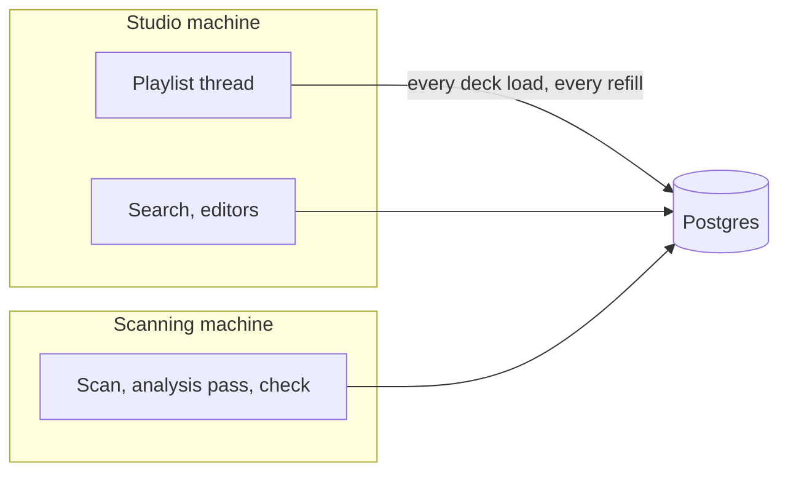
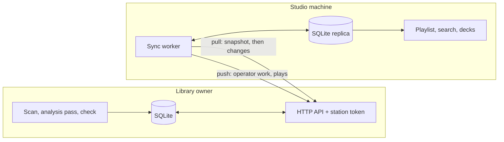
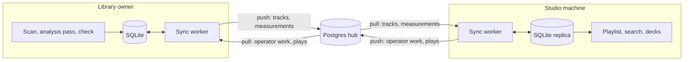
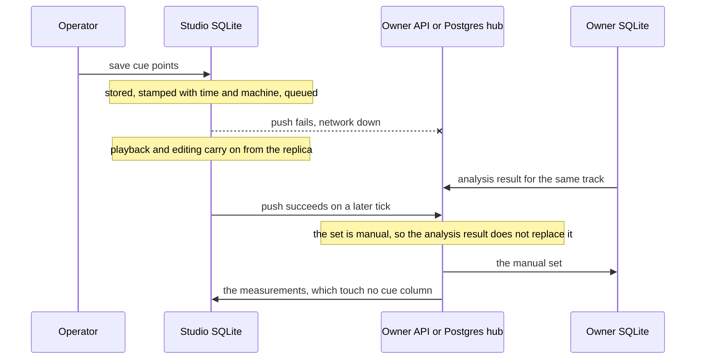
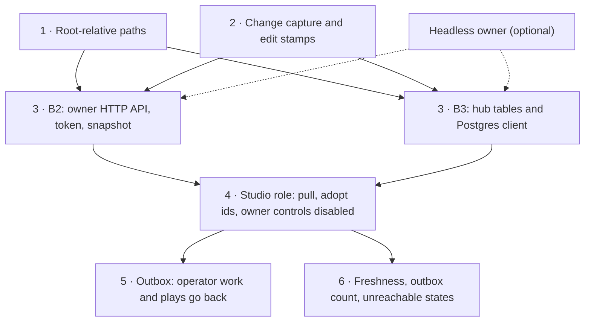

# External library and scanning from another computer

**Partly built.** Option A1 below ships as _Scan when files change_, described
for the operator in
[library-health.md](./library-health.md#scanning-by-itself); everything else here
is a design, not a description. The page answers whether the library can live
somewhere other than the studio machine, and whether a scan can be started — or
run — from another computer. Tracked as
[#495](https://github.com/Arskah/radiodiodj/issues/495). The library as it exists
today is [library.md](./library.md); its schema is [database.md](./database.md).

The ask behind the issue is one thing: **get library scans off the studio
machine.** That splits into two answers with an order of magnitude between them.
A _remote trigger_ leaves the scan where it is and lets something elsewhere start
it — and the cheapest version of that turns out to need no trigger at all, because
the app already watches the disk. An _external library_ shares the library
between machines, makes one of them its owner, and moves the scan there
altogether.

## Today

Seven properties of the current build decide what is cheap and what is not.

**One local SQLite file, opened at launch.** `Db::open`
(`src-tauri/src/library/db.rs`) opens `radiodiodj.db` in the per-user data
directory (`src-tauri/src/lib.rs`), in WAL mode, behind a single
`Mutex<Connection>`:

```rust
pub struct Db {
    conn: Mutex<Connection>,
```

**Nothing abstracts the storage.** `db.rs` and `db/saved_playlists.rs` are some
4 000 lines of rusqlite with the SQL written inline across 66 public methods,
and more than that again in tests that run on an in-memory SQLite. There is no
trait, no enum, no second implementation and no seam where one could be dropped
in. Nothing outside those two files names a SQLite type, but everything holds
the concrete `Db`.

**The schema is SQLite to its bones.** An FTS5 external-content index with three
synchronising triggers, partial indexes, BLOB columns for the waveform and the
level envelope, schema versioning through `PRAGMA user_version` with an epoch in
`PRAGMA application_id`, and pre-migration backups taken with `VACUUM INTO`. See
[database.md](./database.md).

**The file cannot go on the share.** WAL needs a shared-memory mapping beside the
database, which network filesystems do not provide, and SQLite's locking is
unreliable over SMB and NFS in the first place. This is not a performance
objection to be measured — it does not work.

**Paths are absolute and canonicalised.** `Config::add_path`
(`src-tauri/src/persist/config.rs`) stores a canonical path per library root, and
`tracks.path` holds a canonical absolute path per file. The same share is
`/Volumes/radio/music` on macOS, `Z:\music` on Windows and `/mnt/radio/music` on
Linux, so one database cannot describe it for two machines.

**The database is on the on-air path.** Loading a track reads it:
`PlaylistService` calls `get_track_load_info` and `get_paths_by_ids`
(`src-tauri/src/playlist/service.rs`) as the playlist advances. Everything else
about playback is built so a dead share cannot take the station off air — whole
files into RAM, retries, a watchdog ([audio.md](./audio.md),
[playlist.md](./playlist.md)). A library that lives only on the network would
undo that, from the one direction the design has not defended.

**The scan is local by construction.** `scanner::scan_all` walks the roots on
four workers (`SCAN_CONCURRENCY`, `src-tauri/src/library/scanner.rs`), and the
analysis pass then **decodes every file** on `cores - 2` workers, capped at six
(`MAX_CONCURRENCY`, `src-tauri/src/library/waveform_scan.rs`) — reading them one
at a time, because the share cannot take the fan-out the CPU can. That decode is
the expensive part, and it is what an operator wants off the studio machine.

**The disk is already polled.** The library check
(`src-tauri/src/library/check.rs`) lists every root on a timer — fifteen minutes
by default — and reports what the next scan would change: `new`, `changed`,
`gone`, `unrooted`, plus the roots it could not read. It never writes to the
library. The worker already holds `ScanState`, already has an on-demand
`request()`, and each report already carries a `signature()` that identifies
_what_ was found rather than when. See
[library-health.md](./library-health.md#disk-changes).

Two more facts shape the options. There is **no inbound network surface**
anywhere in the app — `reqwest` is a client, for the outbound now-playing webhook
([now-playing-broadcast.md](./now-playing-broadcast.md)), and no server crate is
in `Cargo.toml`. And there is **no headless mode**: one Tauri app, everything
wired in `setup` against an `AppHandle`, with the scan and analysis jobs emitting
their progress to a window.

## Option A — let the machine start its own scan

The studio machine is already looking. Every fifteen minutes it lists the share
and works out exactly which files are new, changed or gone, and then does nothing
with the answer until an operator presses a button. Two variants follow from
that, and the first one needs no trigger, no protocol and no rendezvous.

### A1 — scan when the check finds changes (built)

`library.scanOnChanges` in `tuning`, **off by default**, shown as _Settings →
Library → Scan when files change_. With it on, a check whose report has changes
starts a scan through the same `ScanState::start` path the `scan_libraries`
command uses. The rules below are `LibraryCheck::may_scan` and
`settled_with_changes` in `src-tauri/src/library/check.rs`; what an operator sees
is [library-health.md](./library-health.md#scanning-by-itself).

Then "triggering a scan from another computer" is: copy music onto the share from
wherever you are. Within an interval the studio machine notices and brings itself
up to date. Nothing to install on the other computer, nothing to authenticate, no
control directory, no port.

The design is mostly guards, because a scan is the thing that writes to the
library.

- **It reverses a documented decision.** _"The check never starts a scan"_, under
  the rule that nothing in library health changes the library by itself. The
  setting is the operator's opt-out of that rule, which is why it is off by
  default and why both pages say so.
- **It adds and updates; it does not retire.** Marking tracks missing on the
  strength of a listing nobody watched is the one thing here that could empty a
  library — a stale mount that came back as an empty directory lists perfectly
  happily. A gone row is retired only when the same audio arrives elsewhere in
  the same scan, which is a move, and which has to be retired in the same
  transaction or the scan mints a duplicate. Everything else waits for the
  operator's button.
- **Wait for the disk to settle.** A copy in progress reports the same _paths_
  every time it is looked at, so a path list cannot tell a finished file from a
  growing one — and an in-place overwrite would read identically for the whole
  write. The settle key hashes each new or changed file's path, mtime and size,
  and two consecutive checks must agree on it. Cost: one extra interval of
  latency, so roughly half an hour on the default fifteen.
- **Never on a bad listing.** Any root `unreachable`, or any listing `partial`,
  and the check reports as before and starts nothing. A flapping share must not
  drive a scan loop.
- **Never twice on the same evidence.** A file no tag reader can parse writes no
  row, so it is reported as new forever; without this the share would be
  rescanned every two intervals for good.
- **Never over the operator.** A dismissed report and a cancelled scan both hold
  an automatic scan back.
- **The analysis pass, not the tag backfill.** An automatic scan owes the library
  the same waveforms and cue points the button does, but a cancelled backfill was
  cancelled on purpose and nothing the operator stopped should restart because a
  file appeared.

What A1 cannot do is force a scan on demand — it reacts to the disk, and reacts
one interval late. For that, A2.

### A2 — a scan request file on the share

The station already has one thing every machine can reach and write: the share.
Use it as the rendezvous.

A new `library.scanRequestPath` in `tuning`, **empty by default** so the feature
is off until an operator names a directory. Not a library root — the app never
writes into the music tree, and a root may be read-only.

The library check's worker already wakes at least once a minute, whatever the
check interval is set to:

```rust
/// How often a disabled timer looks at its setting again.
const IDLE_POLL: Duration = Duration::from_secs(60);
```

On each wake it stats one file in that directory. A request file whose mtime is
newer than the last honoured one starts a scan through the same
`ScanState::start` path the `scan_libraries` command uses. No new thread, no new
timer, no new dependency: a `touch` from another computer reaches the studio
machine within about a minute.

The honoured mtime is remembered in `config.json` rather than the file being
deleted. A relaunch must not re-fire a stale request, and the app then needs no
write permission on the request itself.

Feedback goes back the same way. On every `scan-state-changed` transition the app
writes a status file in that directory, carrying the `ScanStatus` the renderer
already receives (`src-tauri/src/library/scan_state.rs`) — so the remote side
polls a file instead of the app needing a reply channel.

Two things to say plainly:

- **This bypasses admin mode.** `scan_libraries` is in `ADMIN_COMMANDS`
  (`src-tauri/src/admin.rs`), so in the UI a scan needs the password. A file
  trigger's authority is write access to that directory, and nothing else. Put
  it where only trusted machines can write. See
  [admin-mode.md](./admin-mode.md).
- **A request mid-show is honoured.** Someone asked for it, at a moment they
  chose. The scan's four workers and the analysis pass's reserved cores are
  already sized to run under playback, the decks read whole files into RAM rather
  than streaming, and _Cancel_ stays in reach in the studio.

A1 and A2 share their machinery and stack cleanly: A1 covers "new music arrived",
A2 covers "scan now, I am not waiting for the interval". A1 is the smaller change
and the one that answers the issue's actual need; A2 is worth building only if
waiting an interval turns out to be the complaint.

What neither fixes: the decode still burns the studio machine's cores and its
share bandwidth. They move the button, not the work. That ceiling is what
makes option B worth pricing rather than dismissing.

## Option B — external library mode

A setting that says the library is shared: one machine owns the scan, and the
studio machines stop doing that work. Three variants. They differ in where the
shared copy lives and in what the app's features talk to, and that second
question is most of the cost.

|                             | B1 — query Postgres            | B2 — a library server of ours | B3 — Postgres as a hub           |
| --------------------------- | ------------------------------ | ----------------------------- | -------------------------------- |
| What the studio reads       | the server, over the network   | its own SQLite                | its own SQLite                   |
| What sits between machines  | Postgres                       | the owner's HTTP API          | Postgres                         |
| SQL dialects to maintain    | two, across the whole surface  | one                           | one, plus a small sync module    |
| FTS5, migrations, backups   | all re-decided                 | untouched                     | untouched                        |
| On-air path                 | crosses the network            | local                         | local                            |
| Server code of ours         | none                           | HTTP server, token, snapshot  | none                             |
| The station installs        | Postgres                       | a second RadiodioDJ           | Postgres and a second RadiodioDJ |
| Who settles a conflict      | the database, in a transaction | the owner process             | rules in the sync protocol       |
| Sync while the owner is off | —                              | no                            | yes                              |
| A dead server costs         | **playback**                   | freshness                     | freshness                        |

**The app ships with SQLite only.** A standalone station installs one desktop
app and no server, and that does not change. So an external database is never
something the app's features query — it can only be something the local
databases replicate through. That rules B1 out and leaves B2 and B3, which turn
out to be the same design with a different thing in the middle.

### B1 — the app queries an external Postgres

Both machines connect to `postgresql://…` and run every library query there.



Priced against the code rather than asserted:

- **A second backend, not a swap.** SQLite has to stay for the standalone
  station, so `Db` becomes a trait with two implementations and every one of its
  66 public methods exists twice from then on. So does every schema change.
- **Every statement is rewritten.** The traps are quiet ones: SQLite's `INTEGER`
  is 64-bit and Postgres' is not, so a unix-millisecond column needs `bigint`;
  SQLite's `REAL` is eight bytes and Postgres' `real` is four, so durations and
  gains need `double precision`; `mtime IS ?`, which is the guard that refuses a
  stale decode, is `IS NOT DISTINCT FROM`; `COLLATE NOCASE` has no direct
  equivalent. And `lower(trim(artist))` is ASCII-only in SQLite, which
  `artist_key` in Rust mirrors on purpose ([rotation.md](./rotation.md)) —
  Postgres lowers by the database locale, so the two sides would disagree on
  `Ä`.
- **Search is re-decided.** The FTS5 index and its three triggers become a
  generated `tsvector` column under a GIN index, with `unaccent` for the
  diacritic folding FTS5 does by default. Ranking changes, and the fuzzy pass
  planned in [library-search.md](./library-search.md) needs a `pg_trgm` twin.
- **Opening is re-decided.** `PRAGMA user_version`, the epoch in
  `application_id`, `rusqlite_migration` and the `VACUUM INTO` backup are all
  SQLite's. [database.md](./database.md) would describe one of two schemes.
- **The mutex was doing work.** `Db` is one `Mutex<Connection>`, so every method
  is serialised against every other, and several lean on that instead of a
  transaction — `set_auto_cue` reads the fades, sorts them and then updates.
  With a pool and a second machine each of those needs a transaction and a row
  lock, and two scans at once need an advisory lock.
- **Version skew locks the studio out.** A build refuses a library newer than
  itself and quits ([database.md](./database.md#opening)). Updates are per
  machine, on an admin's click ([updates.md](./updates.md)). Update the scanning
  machine and the studio machine does not start.
- **The on-air path gets a network hop.** A deck load can fall back to the row
  the playlist item already holds, but a refill is a query, so a long outage
  empties the queue. Timeouts are mandatory, because a wedged server blocks the
  one playlist thread and every transition queued behind it. The only complete
  fix is a local copy of the library — which is the other two variants.
- **The tests.** The library's 183 behaviour tests run on an in-memory SQLite.
  They are its specification, and they would have to pass on both backends.

B1 buys the most and defends the least. Out.

### B2 and B3 — a local replica on every machine

Both keep SQLite exactly as it is today on every machine. One install is the
**library owner**: it reads the share, runs the scan, the analysis pass and the
library check. Studio machines keep a **replica** and read it through the
existing `Db` code, unchanged. A dead network costs a studio library freshness,
never playback, because reads never left the machine — and FTS5, the migrations,
the backups and every read path survive intact.

What differs is the thing in the middle.

**B2 — the owner serves it.** The owner exposes an HTTP API and the studios
talk to the owner.



**B3 — Postgres holds it.** Nothing of ours listens anywhere. The owner and the
studios are all clients of one Postgres, and none of them needs the others to
be running.



The hub is storage and nothing else. No feature queries it, so it needs none of
the library's columns: a row is an id, a revision, the machine it came from, a
deleted flag and the row itself as one JSON document with its two BLOBs beside
it. A column added to `tracks` then changes nothing in Postgres, which is what
keeps B3 from quietly becoming B1's second migration list.

#### What both need

Everything here is the same work under either variant.

**Root-relative paths.** `tracks.path` becomes a library-root id plus a path
relative to it. The list of roots — id and content type — is replicated; the
map from root id to local mount stays in each machine's own `config.json`.

**Change capture.** A machine has to know what it has not sent yet. Triggers on
`tracks`, the saved-playlist tables and `health_dismissals` note each changed
row in a small table, and a purge leaves a tombstone. No `Db` method changes,
and with no external library configured the table is simply never read.

**One owner at a time.** `tracks.id` is a local `AUTOINCREMENT`, so two machines
inserting independently would collide. Only the owner inserts tracks, and a
replica adopts the owner's ids. Joining therefore replaces a studio's local
library, which is what the baseline reset already does
([database.md](./database.md#baseline-resets)): the ids in `session.json` are
dropped, the old file is kept, and the toolbar says why.

**Who may write what.** With a replica that is written to locally, the rules
that used to be one process holding one mutex have to be stated.

| what                                                                                       | written by  | when two machines disagree                                 |
| ------------------------------------------------------------------------------------------ | ----------- | ---------------------------------------------------------- |
| Tags, `mtime`, fingerprint, waveform, loudness, tempo, key, measured duration, level table | owner only  | cannot happen                                              |
| The automatic cue trio                                                                     | owner only  | **a manual set wins, whenever it was made**                |
| Manual cue points and fades                                                                | any machine | the later save wins, for the set as a whole                |
| Metadata edits (`edited_fields` and the columns it flags)                                  | any machine | the later save wins, per field                             |
| A saved playlist                                                                           | any machine | the later save wins, per list                              |
| Health dismissals                                                                          | any machine | the later one wins, per finding                            |
| The airing log and play counts                                                             | any machine | never — appended, and keyed by the machine that aired them |

"Later" is the saving machine's wall clock, which means two studio machines with
clocks apart can let the earlier edit win. That is the price of having no single
process to ask, and it is paid only when two people edit the same thing on two
machines inside the clock error.

**Operator work is saved locally and sent later.** A cue point save or a
metadata edit lands in the local database at once and waits in an outbox while
the other side cannot be reached. A studio is never refused its own work
because of the network — the same reasoning that reads whole files into RAM.
Two things follow: every editable group carries the time and the machine of its
last edit, and a pull never overwrites a group that still has an edit waiting to
go out.



The guard that makes the last steps safe already exists: `set_auto_cue` commits
only while a track is still automatic
([cue-auto-analysis.md](./cue-auto-analysis.md)). It has to hold across the hop
as well as inside one database.

**Play history is never held back.** An airing is written to the local log
first, as today, and pushed afterwards. The log stays the rotation rules' source
on the machine that is on air, and two studios' logs are a union.

**Settings that shape stored data belong to the owner.** The automatic cue
thresholds are per machine today. In this mode the owner's are the station's,
and a studio shows them read-only.

**A version rule, and a gentler one than B1's.** A studio whose build is older
than the owner's keeps its own database and keeps playing; it stops syncing
until it is updated, and says so. Nothing is refused at launch.

**Roles in the UI.** On a studio machine `scan_libraries`, `cancel_scan`,
`cancel_analysis`, `recalculate_auto_cue`, `purge_tracks`, the tag backfill, the
tag writer and the check timer are the owner's, and their controls are disabled
with the reason shown. A studio also shows how fresh its replica is and how many
of its own changes are still waiting to go out.

**Whether the owner has a window is a separate question.** An owner on an office
desktop is an ordinary install in the owner role. An owner on a server needs a
headless mode, which means putting the jobs' `AppHandle` emits behind an event
sink (`scan_state.rs`, `waveform_scan.rs`, `health.rs`). That is the same work
for B2 and B3, and neither needs it to exist.

#### Where they differ

|                           | B2 — the owner serves it                                             | B3 — Postgres holds it                                                      |
| ------------------------- | -------------------------------------------------------------------- | --------------------------------------------------------------------------- |
| New in the app            | an HTTP server crate, a station token, the API                       | a Postgres client crate, the hub's three or four tables, a dozen statements |
| New at the station        | nothing but a second install                                         | a Postgres to install, secure and back up                                   |
| Inbound port              | one, on the owner — never on the on-air machine                      | none of ours; Postgres' own                                                 |
| Credentials               | a station token we design                                            | Postgres roles and TLS, already designed                                    |
| A studio's first copy     | download the owner's database file — `VACUUM INTO` already makes one | pull every row                                                              |
| The owner is switched off | no sync at all; studios keep their outboxes                          | studios still exchange cue points, edits and plays with each other          |
| Conflicts                 | settled inside the owner, in one SQLite transaction                  | settled by each machine applying the same rules to what it pulls            |
| Ordering                  | the owner hands out one sequence                                     | a revision per row; two writers committing out of order need a guard        |
| A second owner by mistake | impossible — studios are pointed at one address                      | needs a lock in the hub                                                     |
| Tested against            | an in-process server, in `cargo test`                                | a Postgres service in CI; local runs skip without one                       |

B2 is more code of ours and nothing new for the station to run. B3 is less code
of ours and a database server the station has to look after — a real cost for a
station that today installs one desktop app, and no cost at all for one that
already runs Postgres for its website.

#### Increments

Each is a PR on its own. The first two are the same under either variant, and
the choice between B2 and B3 does not have to be made before they land.



| #   | increment                                                     | by itself                                                                                                                       |
| --- | ------------------------------------------------------------- | ------------------------------------------------------------------------------------------------------------------------------- |
| 1   | Root-relative track paths, and the root list as library data  | **Worth doing regardless.** Today a mount point that changes name loses the library ([track-identity.md](./track-identity.md)). |
| 2   | Change capture, and a time and machine on each editable group | Inert. A migration and triggers nothing reads yet.                                                                              |
| 3   | The middle: the owner's API (B2) or the hub (B3)              | The owner publishes; nothing consumes.                                                                                          |
| 4   | The studio role                                               | **Delivers the ask**: the scan and the decode are off the studio machine. Read-only — cue work on a studio does not travel yet. |
| 5   | The outbox                                                    | Cue points, metadata edits, saved playlists, dismissals and plays reach the owner and the other studios.                        |
| 6   | The indicators                                                | A studio can see how stale it is and what it still owes.                                                                        |

Two things the first design had are gone. A **`Library` boundary** — the `Db`
surface split so a remote implementation could sit beside the local one — is
not needed once every write lands locally first: there is no remote
implementation, only a worker that moves rows. And **headless mode** is no
longer a step on the way, only a way to run the owner.

## Rejected

| option                                              | why not                                                                                                                                                                                              |
| --------------------------------------------------- | ---------------------------------------------------------------------------------------------------------------------------------------------------------------------------------------------------- |
| The SQLite file itself on the share                 | WAL needs shared memory and network locking is unreliable. Not a tuning question — it does not work.                                                                                                 |
| B1 — querying an external Postgres                  | A second SQL dialect across the whole library for good, and the network on the on-air path. Priced [above](#b1--the-app-queries-an-external-postgres).                                               |
| Postgres only, installed by the station             | One dialect, but a one-laptop station has to install, secure and back up a database server before the app starts.                                                                                    |
| Postgres only, bundled and supervised by the app    | One dialect and nothing to install, but a child database process on the on-air machine with its own start-up, port, shutdown and crash recovery, and its binaries in every installer.                |
| Refusing operator work while the owner is away      | Nothing diverges and no conflict rule is needed, but a studio cannot save a cue point because of a network it does not otherwise depend on.                                                          |
| An HTTP listener in the studio app, just to trigger | An inbound port on the on-air machine, a token to manage, firewall and NAT, and a new dependency, to save a minute over option A. Worth it only if a status page or sub-minute triggering is wanted. |
| Scheduled nightly scans                             | A scan at a fixed hour, changes or not. A1 is the same idea with a better condition: scan because the disk moved, not because the clock did. Worth adding only as a quiet-hours window _around_ A1.  |
| A filesystem watcher                                | Already refused in [library-health.md](./library-health.md#not-built): the timer covers every share, and a watcher would only make local paths report sooner. A1 changes nothing about that.         |

## Verdict

**A1 is built. A2 if waiting an interval turns out to be the complaint. Option B
held — B1 out, and B2 against B3 still to choose.**

A1 was one setting and a handful of guards on a timer that already ticked and
already knew the answer. No schema change, no dependency, no second process, and
nothing to install on the other computer — the operator copies music onto the
share, and the studio machine catches up by itself. Its price is the reversal it
makes explicit: library health stops being a thing that only reports. Its limit
is latency, two intervals in the worst case.

A2 buys immediacy for a control directory, a status file, an mtime remembered in
`config.json` and a plain statement that the admin lock does not cover it. That
is a fair trade, but only against a complaint nobody has made yet.

Option B is the answer if that limit starts to hurt — if the library grows past
what the studio machine should be decoding between shows, or if a second studio
appears. Whatever sits in the middle, the app keeps SQLite and every machine
keeps its own copy: that is the only shape that does not put the network on the
on-air path, and it leaves the schema, the search index and the migration rules
alone.

Between B2 and B3 the question is not technical. It is whether the station
would rather run a database server or have us write one small server. B3 if a
Postgres is already there to use, or if studios should keep exchanging work
while the owner is switched off; B2 if the second install should be the only new
thing in the building. Increments 1 and 2 do not depend on the answer, and
increment 1 is worth doing whether or not the rest ever ships.
